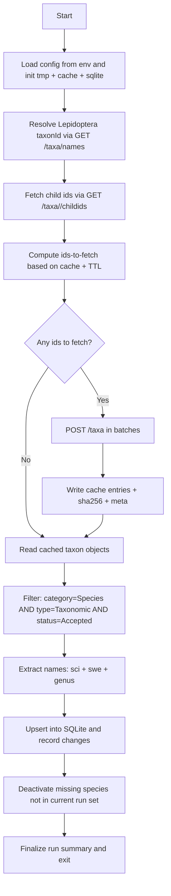

# Architecture

This document describes the high-level architecture and design principles of
the **Boston Viewer** project.

---

## Overview

The system maintains a **local, authoritative snapshot** of all accepted Swedish
Lepidoptera species based on Dyntaxa taxonomy data. The architecture is designed
to be:

- Reproducible
- Incremental
- Low-impact on upstream APIs
- Easy to extend with additional metadata

The pipeline is intentionally linear and explicit.

---

## High-level flow

---

## Components

### 1. API access layer

The pipeline interacts with Dyntaxa via:

- `GET /taxa/names`  
  Resolve taxonId for *Lepidoptera*

- `GET /taxa/{id}/childids`  
  Enumerate all descendant taxa

- `POST /taxa` (batched)  
  Fetch detailed taxon objects efficiently

Authentication is handled via an API subscription key provided as an environment
variable (`ARTDB_KEY`).

---

### 2. Local JSON cache

All taxon objects fetched from the API are stored verbatim as JSON files:

tmp/taxa_cache/<bucket>/<taxonId>.json
tmp/taxa_cache/<bucket>/<taxonId>.meta.json

Each cache entry includes:
- Fetch timestamp
- HTTP status (200 / 404)
- SHA-256 hash of normalized JSON

This allows:
- Minimal repeated API calls
- Fast change detection
- Offline re-processing

---

### 3. Filtering and extraction

From cached taxon objects, the pipeline selects only:

- `category == "Species"`
- `type == "Taxonomic"`
- `status == "Accepted"`

For each accepted species, the following fields are extracted:
- taxonId
- recommended scientific name
- recommended Swedish name
- genus (derived)
- category / type / status

---

### 4. SQLite consolidation

The SQLite database is the **long-lived local authority**.

Key properties:
- Stable `local_index` assigned once per taxonId
- Soft-deactivation instead of deletion
- Full run history in `runs` table
- Per-taxon change tracking in `changes` table

Each pipeline run:
1. Opens a new run record
2. Upserts all currently accepted species
3. Reactivates previously inactive species if needed
4. Deactivates species no longer present
5. Commits run summary statistics

---

## Change detection

Changes are detected using SHA-256 hashes of normalized taxon JSON payloads.

A taxon is considered:
- **Inserted**: not previously present
- **Updated**: content hash changed
- **Reactivated**: previously inactive, now present again
- **Deactivated**: no longer part of the accepted species set

No destructive deletes are performed.

---

## Design constraints and non-goals

Intentional constraints:
- No ORM
- No background daemon
- No automatic scheduling
- No attempt to mirror full Dyntaxa schema

Non-goals:
- Re-publication of raw Artdatabanken data
- Real-time synchronization
- Public API serving

---

## Extensibility

The architecture allows straightforward extension by:
- Adding columns to the `taxa` table
- Attaching additional metadata per taxon
- Exporting SQLite content to binary or analytical formats

The local cache ensures that such extensions do not require additional API
traffic.

